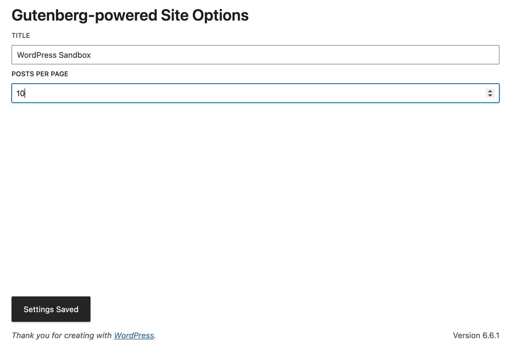

# WP Site Options
A WordPress Plugin that corresponds to a blog post [COMING SOON] on my
site which creates a Gutenberg-powered Site Options page utilizing Gutenberg UI.

## Setup
Run `nvm install` and `npm run build` for your production-ready plugin or `npm run start`
for development mode.

## Information
This approach adds a React app which utilizes Core WordPress Gutenberg dependencies to
manipulate site settings. By default this only edits the `posts_per_page` and `title`, but custom
elements or additional settings can be added with ease. In fact, you're likely not going to want
to add fields for existing site options unless you're trying to clean up the UI in some way. This is
just a proof of concept over the idea of improving the site options experience in the modern day.
